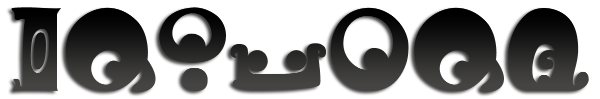

# 👋 Hi there! I'm GenZmeY

- **🔐 Application Security Engineer**
- **🐧 FOSS & Linux Enthusiast**
- **⚙️ Former C++ developer & Golang developer**
- **🛠️ Ex Killing Floor 2 Modder & Server Operator**

---

## 📂 Projects
### 💾 Apps
#### ▪️ multini

  

 
 

A command-line utility for editing INI files, born from the need to automate work with Killing Floor 2 (Unreal Engine 3.5) configs. Games using this engine use duplicate keys with different values ​​in their configs, which other INI utilities don't handle correctly.

#### ▪️ TG-Avatar-Alteration
https://github.com/GenZmeY/TG-Avatar-Alteration
Automatically change your Telegram avatar throughout the day.

### 🎨 Themes
#### ▪️ casper-i18n
https://github.com/GenZmeY/casper-i18n
A theme for the Ghost blogging engine, a fork of Casper with added localization.

### 🎮 Killing Floor 2 Mods
#### ▪️ KF2-AdminAutoLogin
#### ▪️ KF2-BoxPainterLib
#### ▪️ KF2-ControlledVoteCollector
#### ▪️ KF2-CustomTraderInventory

  

  

#### ▪️ KF2-DroppedPickupLifespan
#### ▪️ KF2-LootedTraderInventory
#### ▪️ KF2-SafeMutLoader
#### ▪️ KF2-Server-Extension
#### ▪️ KF2-StartWave
#### ▪️ KF2-TAWOD
#### ▪️ KF2-TrueRandomBoss
#### ▪️ KF2-UnofficialMod
#### ▪️ KF2-YetAnotherScoreboard
#### ▪️ KF2-ZedSpawner
#### ▪️ KF2-ZedternalZeds

### 🎮 Killing Floor 2 Utils
#### ▪️ KF2-AntiDDoS
#### ▪️ KF2-BuildTools
#### ▪️ KF2-Game-Scripts
#### ▪️ KF2-Ranked-Patch
#### ▪️ KF2-SRV

### 🎮 MSK-GS Project
#### ▪️ KF2-MSK-GS
#### ▪️ KF2-MSK-GS-Resources

---
