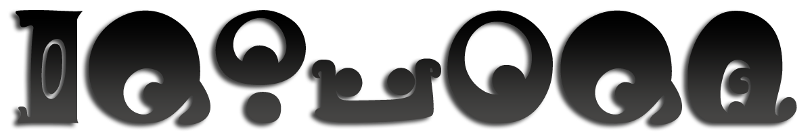

# 👋 Welcome!
 

# 🛠 Projects
|⭐️|Apps & Utils||
|-|:-|-|
||[BookkeepingWatchdog](https://github.com/GenZmeY/BookkeepingWatchdog)|App to control your working time (made for a specific case, so it is unlikely to suit anyone...)|
||[KF2-AntiDDoS](https://github.com/GenZmeY/KF2-AntiDDoS)|DDoS protection of the KF2 server from [one of the attacks faced by community](https://forums.tripwireinteractive.com/index.php?threads/kf2-server-on-centos-linux-ddos-defense-with-the-help-of-firewalld.2337631/)|
||[KF2-BuildTools](https://github.com/GenZmeY/KF2-BuildTools)|KF2 mutator build script with a wide range of features|
||[KF2-SRV](https://github.com/GenZmeY/KF2-SRV)|Command line tool for managing [Killing Floor 2](https://en.wikipedia.org/wiki/Killing_Floor_2) servers|
||[multini](https://github.com/GenZmeY/multini)|Command line tool for manipulating ini files|
||[TG-Avatar-Alteration](https://github.com/GenZmeY/TG-Avatar-Alteration)|Service that automatically changes your [telegram](https://telegram.org) avatar during the day|
|⭐️|**Themes**||
||[casper-i18n](https://github.com/GenZmeY/casper-i18n)|Theme with localization support for [ghost](https://github.com/tryghost/ghost) blog ([casper](https://github.com/TryGhost/Casper) fork)|
|⭐️|**Killing Floor 2 Mutators**||
||[KF2-AdminAutoLogin](https://github.com/GenZmeY/KF2-AdminAutoLogin)|Small server-side mutator that allows specified players to automatically login as an admin|
||[KF2-ControlledVoteCollector](https://github.com/GenZmeY/KF2-ControlledVoteCollector)|New vote collector with improvements and features |
||[KF2-CustomTraderInventory](https://github.com/GenZmeY/KF2-CustomTraderInventory)|Add/Remove Items in the trader's Inventory|
||[KF2-DroppedPickupLifespan](https://github.com/GenZmeY/KF2-DroppedPickupLifespan)|Small server-side mutator that changes the lifespan of thrown weapons and dosh|
||[KF2-LootedTraderInventory](https://github.com/GenZmeY/KF2-LootedTraderInventory)|Remove items from trader's inventory|
||[KF2-SafeMutLoader](https://github.com/GenZmeY/KF2-SafeMutLoader)|Use non-whitelisted mutators and stay ranked|
||[KF2-Server-Extension](https://github.com/GenZmeY/KF2-Server-Extension)|Further development of the [ServerExt mutator](https://github.com/ForrestMarkX/KF2-Server-Extension) from [Marco](https://steamcommunity.com/profiles/76561197975509070) and [Forrest Mark X](https://github.com/ForrestMarkX)|
||[KF2-StartWave](https://github.com/GenZmeY/KF2-StartWave)|Updated version of [Pharrahnox's](https://steamcommunity.com/profiles/76561198021230296) [StartWave](https://steamcommunity.com/sharedfiles/filedetails/?id=1417081496)|
||[KF2-TAWOD](https://github.com/GenZmeY/KF2-TAWOD)|Small server-side mutator that forces players to throw all their weapons on death|
||[KF2-YetAnotherScoreboard](https://github.com/GenZmeY/KF2-YetAnotherScoreboard)|Yet Another Scoreboard for Killing Floor 2|
||[KF2-ZedSpawner](https://github.com/GenZmeY/KF2-ZedSpawner)|Spawner for Zeds|

# 🔗 Links

